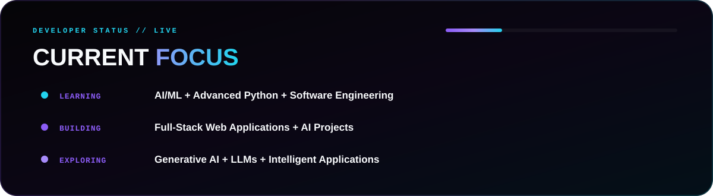
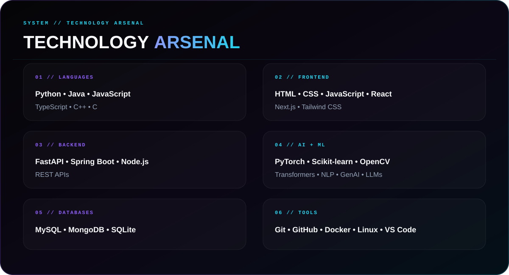
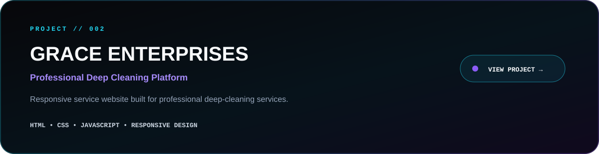
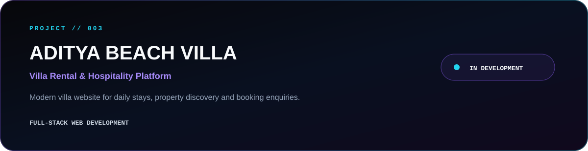
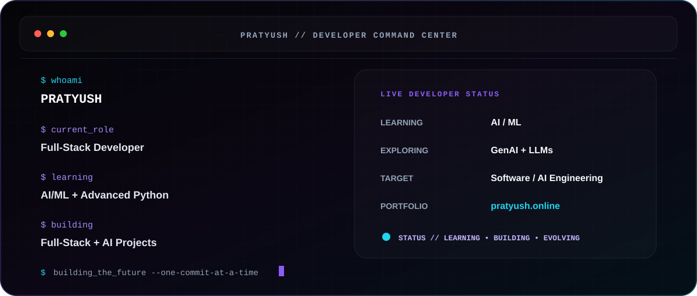
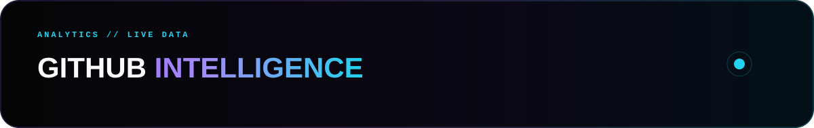

<!-- =========================================================
PRATYUSH // WORLD-CLASS GITHUB PROFILE
SVG-FIRST • RESPONSIVE • ANIMATED • GITHUB-COMPATIBLE
========================================================= -->

  

 

  

 

  

 

  

 

  

 

<!-- =========================================================
SELECTED ENGINEERING WORK
========================================================= -->

 
 

 
 

 
 

<!-- =========================================================
DEVELOPER COMMAND CENTER
========================================================= -->

  

 

<!-- =========================================================
GITHUB INTELLIGENCE
========================================================= -->

  

 

  

  

 

  

 

<!-- =========================================================
CONTRIBUTION ACTIVITY
========================================================= -->

  <picture>
    <source media="(prefers-color-scheme: dark)" srcset="https://raw.githubusercontent.com/pratyushcse/pratyushcse/output/github-contribution-grid-snake-dark.svg">
    <source media="(prefers-color-scheme: light)" srcset="https://raw.githubusercontent.com/pratyushcse/pratyushcse/output/github-contribution-grid-snake.svg">
    
  </picture>

 

<!-- =========================================================
CONTACT / CTA
========================================================= -->

 

  

  

  

 

<!-- =========================================================
FOOTER
========================================================= -->

  

<!-- =========================================================
END // PRATYUSH
========================================================= -->
