<p align="center">
  
</p>

<p align="center">
  
</p>

---

## 👋 About Me

I'm **Pratyush**, a Full-Stack Developer, AI/ML enthusiast, and freelance developer focused on building useful, polished, and scalable digital experiences.

- 🔭 Currently building **full-stack web applications and AI-based projects**
- 🧠 Learning **AI/ML, advanced Python, and software engineering**
- 🤖 Exploring **Generative AI, LLMs, and intelligent applications**
- 💼 Freelance experience building websites for real businesses
- 🎯 Career direction: **Software Engineering • AI Engineering • Full-Stack Development**
- 🌐 Portfolio: [pratyush.online](https://pratyush.online)
- 📩 Email: [pratyushpoojary974@gmail.com](mailto:pratyushpoojary974@gmail.com)

---

## ⚡ Current Focus

```text
> learning     AI/ML + Advanced Python + Software Engineering
> building     Full-Stack Web Applications + AI Projects
> exploring    Generative AI + LLMs + Intelligent Applications
> goal         Become a strong Software / AI / Full-Stack Engineer

---

## 🧩 Technology Arsenal

<p align="center">
  
</p>

### 💻 Languages

<p>
  
</p>

`Python` • `Java` • `JavaScript` • `TypeScript` • `C++` • `C`

### 🎨 Frontend Engineering

<p>
  
</p>

`HTML5` • `CSS3` • `JavaScript` • `TypeScript` • `React` • `Next.js` • `Tailwind CSS`

### ⚙️ Backend Engineering

<p>
  
</p>

`FastAPI` • `Spring Boot` • `Node.js` • `REST APIs`

### 🧠 AI / Machine Learning

<p>
  
</p>

`PyTorch` • `Scikit-learn` • `Hugging Face Transformers` • `OpenCV` • `NLP`

Currently expanding into:

`Machine Learning` • `Deep Learning` • `Generative AI` • `LLMs`

### 🗄️ Databases

<p>
  
</p>

`MySQL` • `MongoDB` • `SQLite`

### 🛠️ Developer Tools

<p>
  
</p>

`Git` • `GitHub` • `Docker` • `VS Code` • `Linux`

<sub>
Focused on continuously strengthening software engineering, AI/ML and full-stack development fundamentals.
</sub>

---

## 🚀 Selected Engineering Work

### AMJ Enterprises

**LED Wall Rental & Visual Solutions Website**

A modern business website created for an LED wall rental company to showcase rental services, visual installations, and customer enquiry options.

**Tech:** HTML • CSS • JavaScript • Responsive Design

[View Repository](https://github.com/pratyushcse/AMJ_Enterprises)

---

### Grace Enterprises

**Professional Deep Cleaning Services Website**

A responsive service-business website designed for a professional deep-cleaning company, with service presentation, business information, and direct customer contact options.

**Tech:** HTML • CSS • JavaScript • Responsive Design

[View Repository](https://github.com/pratyushcse/Grace_Enterprises)

---

### Aditya Beach Villa 🚧

**Villa Rental & Hospitality Website**

Currently developing a modern website for a beach villa offering daily stays and rentals, with a focus on property presentation, amenities, gallery, location, and booking enquiries.

**Tech:** Full-Stack Web Development

**Status:** Currently Building


---

## 📊 GitHub Intelligence

<p align="center">
  

  
</p>

<p align="center">
  
</p>

---

## 🐍 Contribution Activity

<p align="center">
  <picture>
    <source
      media="(prefers-color-scheme: dark)"
      srcset="https://raw.githubusercontent.com/pratyushcse/pratyushcse/output/github-contribution-grid-snake-dark.svg"
    />
    <source
      media="(prefers-color-scheme: light)"
      srcset="https://raw.githubusercontent.com/pratyushcse/pratyushcse/output/github-contribution-grid-snake.svg"
    />
    
  </picture>
</p>

---

## 🧠 Developer Command Center

<p align="center">
  
</p>