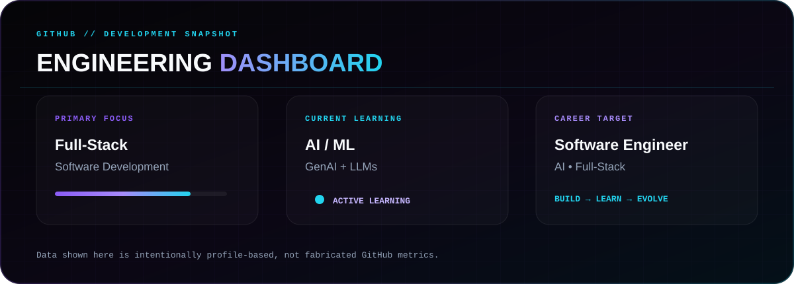

  

 

  

 

  

 

  

 

  

 

 
 

 
 

 
 

  

 

  

 

  

 

  <picture>
    <source
      media="(prefers-color-scheme: dark)"
      srcset="https://raw.githubusercontent.com/pratyushcse/pratyushcse/output/github-contribution-grid-snake-dark.svg"
    >
    <source
      media="(prefers-color-scheme: light)"
      srcset="https://raw.githubusercontent.com/pratyushcse/pratyushcse/output/github-contribution-grid-snake.svg"
    >
    
  </picture>

 

 

  

